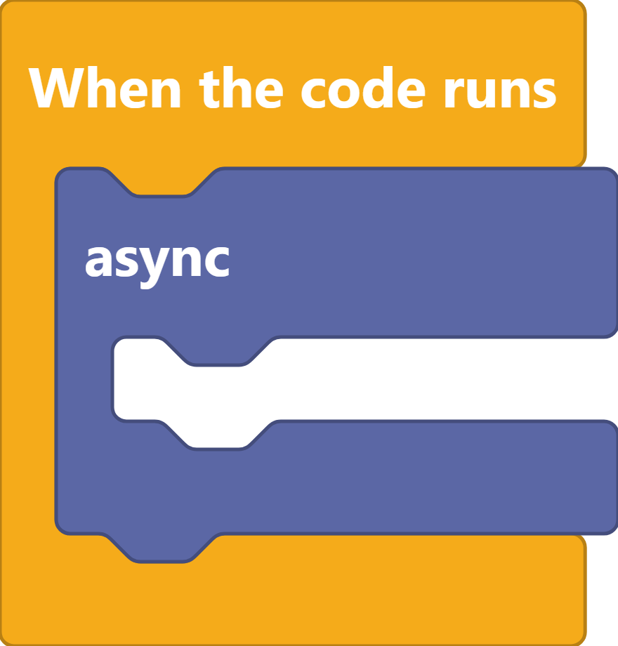

# Text

|                                       Input                                       |                                                                     Function                                                                     |     Output     |                                     Block                                     | format |   Tip  |
| :-------------------------------------------------------------------------------: | :----------------------------------------------------------------------------------------------------------------------------------------------: | :------------: | :---------------------------------------------------------------------------: | :----: | :----: |
|      |                                                             Put any string in there                                                              |       abc      |       | String | Click  |
|  |                                           Make a text from multiple inputs, you can put anything there                                           |     abcABC     |   | String |        |
|  |                                                              in imputed text replace                                                             |      bbb       |   | String |        |
|                                         -                                         |                                                               Check if text is empty                                                             |  true or false |   |        |        |
|      |                                                               Make a text backwards                                                              |       cba      |   |        |        |
|       |                                                                  Adds a new line                                                                 |       /n       |   |        |        |
|                                                                                   |                                                              Append text to variable                                                             |                |   |        |        |
|       |                                                        Return a lenght of a text as number                                                       |        3       |   |        |        |
|      |                                                        Check if text starts with something                                                       |      true      |  |        |        |
|      | Convert [non-ASCII characters](https://terpconnect.umd.edu/\~zben/Web/CharSet/htmlchars.html) to [ASCII characters](https://www.ascii-code.com/) |      HElLO     |   |        |        |


Some blocks that are same are not included here

for example text ends, includes

