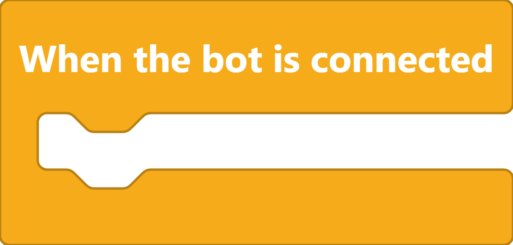

# Bot Setup

## Application Creation

* [x] Go to the [Discord developer portal](https://discord.com/developers/applications)
*   [x] Click on "New Application" on the top right

    <figure><figcaption>
Discord Developer Portal﹣éNew Application" Button
</figcaption></figure>

It will then proceed to ask you a few questions\
Once finished:

*   [x] Click on "Create"

    <figure><figcaption>
Discord Developer Portal﹣"Create an Application" Modal
</figcaption></figure>

## Application Customization

On the left their is a sidebar which has a "General Information" option\
This is where you can customize the bot and add more information

<figure><figcaption>
Discord Developer Portal﹣"General Information" Menu
</figcaption></figure>

## Bot Creation

*   [x] Click on the far right "Add Bot" button

    <figure><figcaption>
Discord Developer Portal﹣"Add Bot" Button
</figcaption></figure>


Scratch for Discord does only work with all Privileged Gateway Intents allowed:

* PRESENCE INTENT
* SERVER MEMBERS INTENT
* MESSAGE CONTENT INTENT


*   [x] Get the [token](../blocks/base.md#token)

    <figure><figcaption>
Discord Developer Portal﹣"Token" Page
</figcaption></figure>


It is impossible to get an already created [token](../blocks/base.md#token):\
If you have lost it, you need to reset it



To know how to use the [token](../blocks/base.md#token), read[#token](../blocks/base.md#token "mention")


## Bot Invitation

*   [x] Click on OAuth2, then on "URL Generator"

    <figure><figcaption>
Discord Developer Portal﹣"OAuth2﹣URL Generator" Menu
</figcaption></figure>
* [x] Select Bot
* [x] Select the BOT PERMISSIONS you need _(recommandation: for a private bot, chose Administrator)_
* [x] Copy the URL
* [x] Invite the bot to the server you need


Further information and official documentation:\
[https://discordjs.guide/preparations/setting-up-a-bot-application.html#creating-your-bot](https://discordjs.guide/preparations/setting-up-a-bot-application.html#creating-your-bot)

